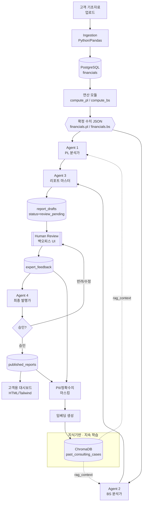

# SPEC.md — 시스템 및 에이전트 기획서

> **문서 상태:** 초안 v0.1 (승인 대기)
> **대상 제품:** 영세사업자 재무/손익 컨설팅 자동화 시스템
> **작성 원칙:** 본문 한국어, 코드 식별자·기술 용어·JSON 키는 영어 유지

---

## 1. 시스템 개요

영세사업자의 기초 자료를 받아 **PL(손익계산서)·BS(재무상태표) 수치를 시스템이 확정 계산**하고,
역할이 분업화된 **4개의 AI 에이전트**가 순차 협업하여 컨설팅 보고서를 생성한다. 중간에
인간 전문가(관리회계 전문가 + 회계/세무 파트너)가 개입하여 피드백을 주는
**Human-in-the-Loop(HITL)** 방식으로 최종 보고서를 발행한다.

### 1.1 핵심 원칙 (Non-negotiable)

| # | 원칙 | 설명 |
|---|------|------|
| P1 | **Strict Rule — 에이전트 무연산** | 어떤 에이전트도 숫자를 직접 계산·추정·반올림하지 않는다. 모든 재무 수치는 Python(Pandas)/DB 로직으로 확정되며, 에이전트는 확정된 결과값(JSON)만 인풋으로 사용하고 그 값을 **인용**만 한다. |
| P2 | **역할 경계 고정** | 각 에이전트는 부여된 역할 범위를 벗어나지 않는다. (예: PL 분석가는 BS 리스크를 판단하지 않는다.) |
| P3 | **인간 우선** | 전문가 피드백이 입력되면 Agent 4는 기존 초안을 고집하지 않고 인간 지시를 최우선으로 반영한다. |
| P4 | **결정론적 수치 / 창의적 서술 분리** | 수치 = 결정론적(DB), 서술·해석 = 생성형(LLM). 두 레이어는 절대 섞이지 않는다. |

### 1.2 아키텍처 다이어그램



### 1.3 전체 프로세스 (6단계)

1. **[시스템] 정형 데이터 수집 및 연산** — 백엔드(Python/PostgreSQL)가 PL·BS 수치를 확정 계산.
2. **[Agent 1 — PL 분석가]** — **분석 시작 시 유사 과거 케이스를 RAG로 조회(`rag_context`)** 후, 수익성·원가구조·영업이익률 변동요인·마일스톤 성과 분석.
3. **[Agent 2 — BS 분석가]** — **분석 시작 시 유사 과거 케이스를 RAG로 조회(`rag_context`)** 후, 운전자본·단기 현금흐름·부채비율 등 재무 건전성/리스크 분석.
4. **[Agent 3 — 리포트 마스터]** — Agent 1·2 결과 종합, 상호 모순 점검, 1차 초안 작성.
5. **[Human Review]** — 백오피스 UI에서 전문가가 초안 검토 후 피드백 입력.
6. **[Agent 4 — 최종 발행가]** — 피드백을 완벽 반영해 재작성, 승인 시 고객용 대시보드 데이터로 퍼블리싱.
7. **[시스템] 지속 학습 적재** — 발행(`published`) 직후 **비동기**로, 최종 리포트 + 전문가 피드백을 **마스킹→임베딩**하여 `past_consulting_cases` 컬렉션에 적재(§1.4, §3.4). 이 결과가 다음 컨설팅의 2·3단계 `rag_context`로 재사용된다.

### 1.4 지속 학습(Continuous Learning) 루프

시스템이 일회성 분석에 그치지 않고, 컨설팅을 진행할수록 전문가의 판단과 최종 리포트를
자산화하여 다음 컨설팅 품질을 높이는 **양방향 피드백 루프**를 갖춘다.

- **역방향(적재):** 컨설팅 완료(`published`) → 최종 리포트(`published_reports`) + 전문가
  피드백(`expert_feedback`)을 **마스킹**(PII·정확 금액 제거/일반화) → 임베딩 생성 →
  `past_consulting_cases` 컬렉션에 upsert. 발행 직후 **비동기**로 실행되어 고객 대시보드
  응답을 지연시키지 않는다. 적재 이력은 감사 테이블 `kb_ingestions`에 기록(§3.2).
- **정방향(조회):** Agent 1·2가 분석을 시작할 때, **현재 대상 고객의 업종 + 재무상태(비율 밴드)**
  와 가장 유사한 과거 성공 케이스 및 전문가 피드백 이력을 RAG로 조회(top_k, 최소 유사도 임계값)하여
  `rag_context`로 입력받는다. 임계값 미달이면 컨텍스트를 주입하지 않는다(빈 컨텍스트).
- **Strict Rule 불변(P1):** RAG는 **정성적 참고(컨설팅 노하우·업종 벤치마크 밴드·전문가 교훈)**
  만 제공한다. 현재 고객에 대해 에이전트가 진술하는 **모든 수치는 여전히 `financials.*` 확정
  JSON에서만** 온다. 과거 케이스의 수치를 현재 고객의 확정치로 인용하는 것은 금지되며,
  `numeric_guard`는 변함없이 현재 고객 수치에만 적용된다.

---

## 2. 멀티 에이전트 파이프라인 정의

모든 에이전트는 **Claude Messages API (`claude-opus-4-8`, adaptive thinking)** 로 구동된다.
각 에이전트는 커스텀 Python 오케스트레이터가 호출하는 **단일 책임 함수/클래스**이며,
공통 계약은 다음과 같다.

- **입력:** 시스템이 확정한 JSON(수치) + (Agent 1·2) `rag_context`(유사 과거 케이스, §1.4) + (Agent 4 한정) 전문가 피드백.
- **출력:** 정의된 JSON 스키마를 따르는 구조화 결과 (structured outputs / `output_config.format` 사용).
- **금지:** 입력 JSON에 없는 숫자를 새로 생성하거나 산술 결과를 만들어내는 것. `rag_context`의 과거 수치를 현재 고객 확정치로 인용하는 것(P1, §1.4).

### 2.1 Agent 1 — PL 분석가

| 항목 | 내용 |
|------|------|
| **페르소나** | 대형 건설사에서 원가 관리·예산 교차검증·마일스톤 성과 모니터링을 수행한 관리회계 전문가 |
| **책임 범위** | 수익성 분석, 원가 구조 분석, 영업이익률 변동 요인, 마일스톤 기반 성과 |
| **하지 않는 것 (역할 경계)** | BS(운전자본·부채·현금흐름) 리스크 판단, 세무 이슈 판단, 최종 종합 결론 |
| **입력** | `financials.pl` 확정 JSON, `rag_context`(유사 과거 PL 케이스·전문가 교훈, §1.4·§2.6) |
| **출력** | `agent1_pl_analysis` JSON (아래 2.6) |
| **프롬프트 전략** | (1) 페르소나 고정, (2) "제공된 확정 수치만 인용, 새 숫자 생성 금지" 규약 삽입, (3) 각 주장에 근거가 되는 `source_ref`(어느 계정과목·기간) 명시 강제, (4) 역할 경계 밖 주제는 "본 분석 범위 아님"으로 명시, (5) **`rag_context`의 유사 과거 케이스·전문가 교훈은 정성 참고로만 사용 — 과거 수치를 현재 고객 확정치로 인용 금지(P1, §1.4)** |

### 2.2 Agent 2 — BS 분석가

| 항목 | 내용 |
|------|------|
| **페르소나** | 세무/회계 전문 파트너 |
| **책임 범위** | 운전자본(Working Capital), 단기 현금흐름, 부채 비율, 재무 건전성 및 리스크 요소 |
| **하지 않는 것 (역할 경계)** | PL 수익성/원가구조 판단, 마일스톤 성과 판단, 최종 종합 결론 |
| **입력** | `financials.bs` 확정 JSON, `rag_context`(유사 과거 BS 케이스·전문가 교훈, §1.4·§2.6) |
| **출력** | `agent2_bs_analysis` JSON (아래 2.6) |
| **프롬프트 전략** | Agent 1과 동일한 무연산·근거명시 규약 + 리스크 항목별 심각도(`severity`) 라벨링 강제 + **`rag_context`는 정성 참고로만 사용, 과거 수치를 현재 고객 확정치로 인용 금지(P1, §1.4)** |

### 2.3 Agent 3 — 리포트 마스터

| 항목 | 내용 |
|------|------|
| **페르소나** | 두 전문가의 분석을 고객 언어로 통역하는 컨설팅 에디터 |
| **책임 범위** | Agent 1·2 결과 종합, **상호 모순 점검**, 고객이 이해하기 쉬운 언어로 1차 컨설팅 초안 작성 |
| **하지 않는 것 (역할 경계)** | 새로운 재무 판단 생성(두 에이전트 결과 범위 내에서만 종합), 수치 재계산 |
| **입력** | `agent1_pl_analysis`, `agent2_bs_analysis` |
| **출력** | `agent3_draft_report` JSON (아래 2.6) + `contradiction_flags` 배열 |
| **프롬프트 전략** | (1) 모순 점검을 별도 필드로 강제(예: PL은 호전, BS는 현금경색 → 상충 플래그), (2) 전문 용어→쉬운 설명 변환, (3) 확정 수치 인용 시 원본 값 유지 검증 |

### 2.4 Agent 4 — 최종 발행가

| 항목 | 내용 |
|------|------|
| **페르소나** | 전문가 피드백을 반영해 최종본을 책임 발행하는 에디터 |
| **책임 범위** | 전문가 피드백을 **최우선**으로 반영하여 보고서 재작성, 승인 시 고객용 대시보드 데이터로 퍼블리싱 |
| **하지 않는 것 (역할 경계)** | 피드백과 배치되는 자기 주장 고집, 수치 변경 |
| **입력** | `agent3_draft_report`(또는 직전 버전), `expert_feedback`, 원본 확정 수치 JSON |
| **출력** | `agent4_final_report` JSON + `dashboard_payload` JSON (아래 2.6, 2.7) |
| **프롬프트 전략** | (1) "전문가 지시 = 최우선, 초안과 충돌 시 지시를 따른다" 규약, (2) 반영 내역(`applied_feedback`) 명시로 추적성 확보, (3) 확정 수치 불변 재확인 |

### 2.5 에이전트 공통 규약 (System Prompt 삽입 블록)

모든 에이전트 시스템 프롬프트에 다음 블록을 공통 삽입한다.

```
[불변 규약]
1. 너는 숫자를 계산·추정·반올림하지 않는다. 제공된 확정 수치(JSON)의 값만 그대로 인용한다.
2. 제공된 데이터에 없는 수치를 언급하지 않는다. 필요한 값이 없으면 "데이터 없음"이라고 적는다.
3. 너의 역할 범위를 벗어난 주제는 판단하지 않고 "본 분석 범위 아님"으로 표기한다.
4. 모든 정량적 주장에는 근거가 되는 source_ref(계정과목/기간)를 붙인다.
5. 출력은 지정된 JSON 스키마를 정확히 따른다.
```

### 2.6 에이전트 I/O JSON 스키마 (요약)

> 상세 필드는 구현 단계에서 `schemas/` 아래 JSON Schema 파일로 관리한다. 아래는 계약(contract) 수준 정의.

**입력 — `financials.pl` (Python 연산 모듈 → Agent 1)**
```json
{
  "meta": { "client_id": "C-1001", "period": "2025-Q2", "prev_period": "2025-Q1", "currency": "KRW", "computed_at": "2026-07-07T09:00:00+09:00" },
  "accounts": [
    { "code": "REV", "name": "매출액", "amount": 120000000, "prev_amount": 100000000, "yoy_pct": 20.0 },
    { "code": "COGS", "name": "매출원가", "amount": 78000000, "prev_amount": 70000000, "yoy_pct": 11.4 },
    { "code": "GP", "name": "매출총이익", "amount": 42000000, "prev_amount": 30000000, "yoy_pct": 40.0 },
    { "code": "OPEX", "name": "판매관리비", "amount": 25000000, "prev_amount": 22000000, "yoy_pct": 13.6 },
    { "code": "OP", "name": "영업이익", "amount": 17000000, "prev_amount": 8000000, "yoy_pct": 112.5 }
  ],
  "ratios": [
    { "code": "GPM", "name": "매출총이익률", "value_pct": 35.0, "prev_value_pct": 30.0 },
    { "code": "OPM", "name": "영업이익률", "value_pct": 14.2, "prev_value_pct": 8.0 }
  ],
  "milestones": [
    { "code": "M1", "name": "1차 마일스톤", "planned": 50000000, "actual": 52000000, "variance_pct": 4.0 }
  ]
}
```

**입력 — `financials.bs` (Python 연산 모듈 → Agent 2)**
```json
{
  "meta": { "client_id": "C-1001", "period": "2025-Q2", "currency": "KRW", "computed_at": "2026-07-07T09:00:00+09:00" },
  "accounts": [
    { "code": "CA", "name": "유동자산", "amount": 90000000 },
    { "code": "CL", "name": "유동부채", "amount": 60000000 },
    { "code": "INV", "name": "재고자산", "amount": 30000000 },
    { "code": "AR", "name": "매출채권", "amount": 40000000 },
    { "code": "AP", "name": "매입채무", "amount": 25000000 },
    { "code": "DEBT", "name": "총부채", "amount": 110000000 },
    { "code": "EQUITY", "name": "자본총계", "amount": 80000000 }
  ],
  "ratios": [
    { "code": "CR", "name": "유동비율", "value_pct": 150.0 },
    { "code": "WC", "name": "운전자본", "value": 30000000 },
    { "code": "DR", "name": "부채비율", "value_pct": 137.5 }
  ]
}
```

**출력 — `agent1_pl_analysis` (Agent 1 → Agent 3)**
```json
{
  "agent": "pl_analyst",
  "summary": "영업이익률이 전기 8.0%에서 14.2%로 개선되었다.",
  "findings": [
    { "topic": "profitability", "text": "매출총이익률이 30.0%→35.0%로 상승.", "source_ref": ["GPM"], "impact": "positive" },
    { "topic": "cost_structure", "text": "판관비 증가율(13.6%)이 매출 증가율(20.0%)보다 낮아 레버리지 효과.", "source_ref": ["OPEX", "REV"], "impact": "positive" }
  ],
  "milestone_review": [
    { "code": "M1", "text": "1차 마일스톤 실적이 계획 대비 4.0% 초과 달성.", "source_ref": ["M1"] }
  ],
  "out_of_scope": ["현금흐름/부채 리스크는 본 분석 범위 아님"]
}
```

**출력 — `agent2_bs_analysis` (Agent 2 → Agent 3)**
```json
{
  "agent": "bs_analyst",
  "summary": "유동비율 150%로 단기 지급능력은 양호하나 부채비율 137.5%는 관리 필요.",
  "findings": [
    { "topic": "working_capital", "text": "운전자본 3,000만원 확보.", "source_ref": ["WC"], "severity": "low" },
    { "topic": "leverage", "text": "부채비율 137.5%로 업종 평균 대비 주의.", "source_ref": ["DR"], "severity": "medium" }
  ],
  "out_of_scope": ["수익성/원가 구조는 본 분석 범위 아님"]
}
```

**출력 — `agent3_draft_report` (Agent 3 → DB → Human Review)**
```json
{
  "agent": "report_master",
  "sections": [
    { "id": "overview", "title": "종합 요약", "body_md": "..." },
    { "id": "profitability", "title": "수익성", "body_md": "..." },
    { "id": "financial_health", "title": "재무 건전성", "body_md": "..." },
    { "id": "actions", "title": "권고 사항", "body_md": "..." }
  ],
  "contradiction_flags": [
    { "between": ["pl_analyst", "bs_analyst"], "text": "수익성은 개선되나 부채비율 상승 — 성장-레버리지 균형 점검 필요.", "resolved": false }
  ],
  "cited_values": ["OPM", "GPM", "CR", "DR", "WC"]
}
```

**입력 — `expert_feedback` (Human Review → Agent 4)**
```json
{
  "draft_id": "D-2025Q2-C1001-v1",
  "reviewer": "partner_tax",
  "instructions": [
    { "target_section": "actions", "directive": "부채비율 관리 방안으로 매출채권 회수기일 단축을 구체적으로 제안할 것.", "priority": "high" },
    { "target_section": "profitability", "directive": "표현을 더 쉽게, 사장님 눈높이로.", "priority": "medium" }
  ],
  "overall_note": "리스크 톤을 과장하지 말 것."
}
```

**출력 — `agent4_final_report` (Agent 4 → 승인 → 발행)**
```json
{
  "agent": "final_publisher",
  "version": "v2",
  "sections": [ { "id": "overview", "title": "종합 요약", "body_md": "..." } ],
  "applied_feedback": [
    { "from": "partner_tax", "directive_ref": "매출채권 회수기일 단축 제안", "how_applied": "actions 섹션에 30일 단축 시 운전자본 개선 효과 서술 추가" }
  ],
  "cited_values": ["OPM", "GPM", "CR", "DR", "WC"]
}
```

**입력 — `rag_context` (지속 학습 조회 → Agent 1·2, §1.4)**

Agent 1·2가 분석 시작 시 RAG로 조회한 유사 과거 케이스. **정성 참고 전용**이며, 현재 고객의
수치 원천이 아니다(P1). `cases`는 마스킹된 요약·교훈만 담고, 과거 고객의 PII·정확 금액은 없다.
`similarity`가 임계값 미달이면 `cases`는 빈 배열이 된다.

```json
{
  "query": { "industry": "도소매", "ratio_band": { "OPM": "10-15%", "DR": "130-150%" } },
  "cases": [
    {
      "case_id": "K-000042",
      "similarity": 0.87,
      "industry": "도소매",
      "situation_summary": "(마스킹) 매출은 성장하나 부채비율이 상승하던 소매업 사례.",
      "expert_lessons": ["매출채권 회수기일 단축이 부채비율 개선에 유효했음", "재고 회전 관리 병행 권고"],
      "outcome": "success"
    }
  ],
  "retrieved_at": "2026-07-07T09:00:05+09:00"
}
```

**적재 레코드 — `past_consulting_cases` (발행 후 마스킹·임베딩 → ChromaDB, §1.4·§3.4)**

발행 완료본과 전문가 피드백에서 추출·마스킹하여 컬렉션에 저장하는 케이스 레코드.
**`client_id`/고객명/정확 금액/PII를 포함하지 않는다.** 재무 프로파일은 비율 밴드로만 일반화한다.

```json
{
  "case_id": "K-000042",
  "industry": "도소매",
  "period_generalized": "2025-상반기",
  "financial_profile": { "OPM_band": "10-15%", "GPM_band": "30-40%", "CR_band": "140-160%", "DR_band": "130-150%" },
  "situation_summary": "(마스킹) 매출 성장기의 부채비율 상승 국면.",
  "expert_lessons": ["매출채권 회수기일 단축으로 부채비율 개선", "리스크 톤 과장 지양"],
  "outcome_label": "success",
  "masking_version": "v1",
  "embedded_at": "2026-07-07T10:00:00+09:00"
}
```

### 2.7 고객용 대시보드 페이로드 — `dashboard_payload`

Agent 4 승인 후 퍼블리싱 시 생성. **수치 필드는 확정 JSON에서 그대로 복사**되며 에이전트가 만들지 않는다.

```json
{
  "client": { "name": "○○상사", "period": "2025년 2분기" },
  "kpis": [
    { "key": "OPM", "label": "영업이익률", "value_pct": 14.2, "delta_pct": 6.2, "trend": "up" },
    { "key": "CR", "label": "유동비율", "value_pct": 150.0, "trend": "flat" },
    { "key": "DR", "label": "부채비율", "value_pct": 137.5, "trend": "up", "flag": "watch" },
    { "key": "WC", "label": "운전자본", "value": 30000000, "trend": "up" }
  ],
  "charts": [
    { "id": "op_trend", "type": "line", "series_ref": ["OP"], "periods": ["2025-Q1", "2025-Q2"] }
  ],
  "report_sections": [ { "id": "overview", "title": "종합 요약", "body_md": "..." } ]
}
```

---

## 3. Human-in-the-Loop 데이터 플로우

### 3.1 상태 머신 (report 라이프사이클)

`report_drafts.status` 컬럼으로 관리한다.

| status | 의미 | 진입 조건 | 다음 상태 |
|--------|------|-----------|-----------|
| `computed` | 확정 수치 계산 완료 | Python 연산 모듈 완료 | → `drafting` |
| `drafting` | Agent 1~3 실행 중 | 오케스트레이터가 파이프라인 시작 | → `review_pending` |
| `review_pending` | 1차 초안 저장, 전문가 검토 대기 | Agent 3 초안 DB 저장 | → `revising` |
| `revising` | Agent 4 재작성 중 | 전문가 `expert_feedback` 입력 | → `review_pending`(재검토) 또는 → `approved` |
| `approved` | 전문가 최종 승인 | 검토자가 승인 버튼 | → `published` |
| `published` | 고객 대시보드 발행 완료 | `dashboard_payload` 생성 | (종료) |
| `failed` | 파이프라인/검증 실패 | 스키마 위반·검증 훅 실패 | → `drafting`(재시도) |

### 3.2 데이터 저장 테이블 (개념 스키마)

> 상세 DDL은 구현 단계에서 마이그레이션으로 관리. 여기서는 계약 수준.

- `clients` — 고객 마스터.
- `financials` — 확정 수치(원천). `financials.pl`, `financials.bs` JSON 스냅샷 보관.
- `report_drafts` — `id`, `client_id`, `period`, `version`, `status`, `payload_json`(에이전트 산출물), `created_at`.
- `expert_feedback` — `id`, `draft_id`, `reviewer`, `instructions_json`, `created_at`.
- `published_reports` — `id`, `draft_id`(approved), `dashboard_payload_json`, `published_at`.
- `agent_runs` — 감사 로그: `agent`, `input_hash`, `output_hash`, `model`, `latency_ms`, `validation_passed`.
- `kb_ingestions` — 지속 학습 적재 감사(§3.4): `id`, `draft_id`, `case_id`, `masking_version`, `embedded_at`, `status`(멱등성·재시도 추적).

### 3.3 재작성 루프 규칙 (P3 인간 우선)

- 전문가 피드백이 있으면 Agent 4는 **초안보다 피드백을 우선**한다.
- Agent 4 산출물에는 `applied_feedback` 배열로 각 지시의 반영 방식을 명시(추적성).
- 검토자가 재검토를 요청하면 `revising → review_pending` 루프를 반복한다. 버전은 `v1, v2, ...`로 증가.

### 3.4 지속 학습 적재 (발행 후 비동기)

- 리포트가 `published`에 도달하면, 오케스트레이터가 **비동기 적재 잡**을 트리거한다
  (report 상태 머신 값은 변경하지 않는다 — 별도 잡으로 표현).
- 잡 순서: `published_reports` + `expert_feedback` 로드 → **마스킹**(PII·정확 금액 제거/밴드화,
  `CLAUDE.md §3.5`) → `past_consulting_cases` 레코드 생성 → 임베딩 → 컬렉션 upsert.
- **멱등성:** 동일 `draft_id`는 한 번만 적재(재실행 시 upsert). 성공/실패·`masking_version`을
  `kb_ingestions`에 기록하고, 실패는 재시도한다.
- 마스킹 실패 또는 PII/정확 금액 잔존이 감지되면 적재를 중단하고 이슈로 기록(`pii_leak`).

---

## 4. Python 연산 모듈 ↔ AI 에이전트 I/O 규격

### 4.1 경계 규약 (Strict Rule 구현)

- **연산 레이어(Python/Pandas/DB)**: 모든 산술·비율·전기대비·마일스톤 variance를 계산하여 `financials.pl` / `financials.bs` JSON을 확정 생성. 이 JSON이 **유일한 수치 원천(source of truth)**.
- **에이전트 레이어(LLM)**: 위 JSON을 읽어 **서술/해석/권고**만 생성. 숫자는 인용만.
- **검증 훅(validation hook)**: 에이전트 출력 텍스트/필드에 등장하는 모든 수치가 입력 JSON의 값 집합(허용 오차 0)에 존재하는지 대조. 불일치 시 해당 run을 `failed` 처리하고 재시도 또는 사람 개입. (상세 규칙은 `CLAUDE.md`의 가드레일 절 참조.)

### 4.2 데이터 흐름 요약

```
raw upload → ingest(Pandas) → compute_pl()/compute_bs() → financials.* (JSON, DB)
   → [Agent1|Agent2] → Agent3 → report_drafts(review_pending)
   → Human feedback(expert_feedback) → Agent4 → approved → dashboard_payload → published

지속 학습(양방향):
   역방향  published + expert_feedback → mask → embed → past_consulting_cases (ChromaDB)
   정방향  past_consulting_cases → (업종+비율밴드 유사도 조회) → rag_context → [Agent1|Agent2]
```

### 4.3 모델·API 사용 규격

- 기본 모델: `claude-opus-4-8` (Messages API).
- Thinking: `adaptive` (복잡한 종합/모순 점검 단계에 유리).
- 구조화 출력: `output_config.format`(JSON Schema)로 스키마 강제 — 프리필 미사용.
- 확정 수치 조회는 오케스트레이터가 프롬프트에 JSON을 주입하거나 tool-use로 DB 조회.
- 비밀키는 `.env`(`ANTHROPIC_API_KEY`)로 관리(코드 하드코딩 금지).

---

## 5. 요구사항 매핑 체크리스트 (자체 검증)

| 사용자 요구 | 반영 위치 |
|-------------|-----------|
| 멀티 에이전트 파이프라인 구조 | §1.2, §2 |
| 각 에이전트 역할/프롬프트 전략 | §2.1~2.5 |
| HITL 데이터 플로우(초안→저장→피드백→재작성) | §1.3, §3 |
| Python 연산 ↔ 에이전트 I/O JSON 규격 | §2.6, §2.7, §4 |
| Strict Rule(에이전트 무연산) | P1, §2.5, §4.1 |
| 역할 경계 | P2, §2.1~2.4 |
| 인간 피드백 최우선 | P3, §2.4, §3.3 |
| 지속 학습 루프(역방향 피드백 파이프라인) | §1.2, §1.4, §3.4, §4.2 |
| Agent 1·2 RAG 조회(`rag_context`) | §1.3(2·3단계), §1.4, §2.1, §2.2, §2.6 |
| 마스킹(PII·정확 금액 제거) | §1.4, §3.4, `CLAUDE.md §3.5` |
