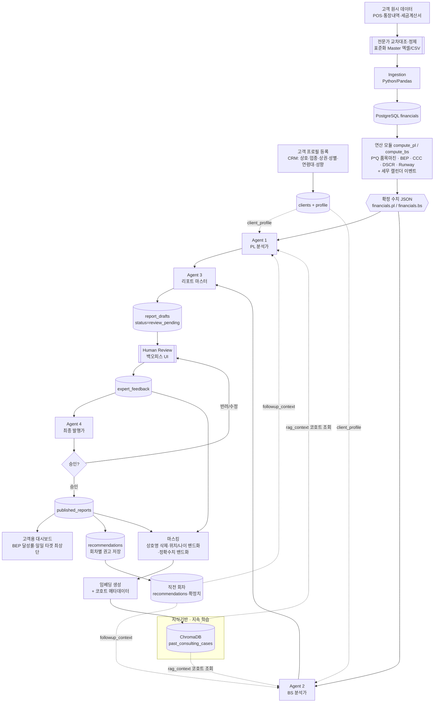

# SPEC.md — 시스템 및 에이전트 기획서

> **문서 상태:** 개정 v0.3 (전면 개정, 승인 대기)
> **대상 제품:** 영세사업자 재무/손익 컨설팅 자동화 시스템
> **작성 원칙:** 본문 한국어, 코드 식별자·기술 용어·JSON 키는 영어 유지
>
> **v0.3 개정 요지:** 단순 총액 기준 분석을 폐기하고 다음을 도입 —
> ① 미시적 원가/마진 분석(P*Q), ② 실전 현금흐름(CCC·DSCR·Cash Runway),
> ③ 손익분기점(BEP) 타겟팅 + 일일 최소 판매수량, ④ 세무 캘린더 기반 현금 유보(흑자도산 방지),
> ⑤ 시계열 전후 비교(Follow-up), ⑥ 고객 일반정보(CRM) 축적 → 코호트(카테고리)별 맞춤 컨설팅.

---

## 1. 시스템 개요

영세사업자의 **원시 데이터(POS·통장내역 등)를 전문가가 교차 대조·정제한 표준화 Master 양식**으로
받아, 시스템이 **품목 단위(P*Q)까지 내려가는 PL·BS 확정 수치**(BEP·CCC·DSCR·Cash Runway 포함)를
계산한다. 역할이 분업화된 **4개의 AI 에이전트**가 **고객 프로필(CRM)·직전 회차 이행 성과**를
함께 주입받아 협업 분석하고, 인간 전문가(관리회계 전문가 + 회계/세무 파트너)가 개입하는
**Human-in-the-Loop(HITL)** 방식으로 최종 보고서를 발행한다. 발행된 자산은 마스킹 후
코호트 메타데이터와 함께 지식기반에 축적되어, **프랜차이즈 본사 수준의 카테고리별 맞춤
컨설팅**으로 진화한다.

### 1.1 핵심 원칙 (Non-negotiable)

| # | 원칙 | 설명 |
|---|------|------|
| P1 | **Strict Rule — 에이전트 무연산** | 어떤 에이전트도 숫자를 직접 계산·추정·반올림하지 않는다. 모든 재무 수치(품목 마진·BEP·CCC·DSCR 등 파생 지표 포함)는 Python(Pandas)/DB 로직으로 확정되며, 에이전트는 확정된 결과값(JSON)만 인풋으로 사용하고 그 값을 **인용**만 한다. |
| P2 | **역할 경계 고정** | 각 에이전트는 부여된 역할 범위를 벗어나지 않는다. (예: PL 분석가는 BS 리스크를 판단하지 않는다.) |
| P3 | **인간 우선** | 전문가 피드백이 입력되면 Agent 4는 기존 초안을 고집하지 않고 인간 지시를 최우선으로 반영한다. |
| P4 | **결정론적 수치 / 창의적 서술 분리** | 수치 = 결정론적(DB), 서술·해석 = 생성형(LLM). 두 레이어는 절대 섞이지 않는다. |
| P5 | **데이터 정제 주권 — 전문가 게이트** | 고객은 원시 데이터만 제공한다. 시스템에 들어가는 모든 수치는 전문가가 교차 대조·정제한 **표준화 Master 양식**을 통해서만 유입된다(쓰레기 입력 차단). |
| P6 | **연속성 — 컨설팅은 1회성이 아니다** | 모든 분석은 직전 회차 권고·이행 성과(Follow-up)와 고객 프로필 맥락 위에서 수행되고, 발행 자산은 코호트 지식으로 재축적된다. |

### 1.2 아키텍처 다이어그램



### 1.3 전체 프로세스 (0~8단계)

0. **[관리자] 고객 프로필 등록(CRM)** — 신규 고객 등록 시 백오피스에 **필수 프로필**(상호, 업종, 상권 유형, 대표자 성별, 연령대, 리스크 수용 성향 등, §2.6 `client_profile`)을 등록한다.
1. **[관리자] 원시 데이터 수령 → 전문가 정제 → Master 업로드** — 고객은 POS·통장내역 등 원시 데이터만 제공. 전문가가 교차 대조(매출 대사 등)하여 **표준화 Master 엑셀/CSV 양식**으로 정제해 백오피스에 업로드(P5).
   - **(Phase 9) P5 자동 표준화 보조:** 전문가는 `POST /api/consulting/parse`로 비표준 원시 데이터(POS 타임라인·배달 정산·세금계산서 텍스트)를 **LLM 데이터 엔지니어(Agent 0)**에 넣어 **표준화 Master 초안** + 대사 리포트(reconciliation)를 받는다. Agent 0은 무연산(의미론적 매핑·정규화·동적 스키마 확장만)이고, 집계·총합 대사는 `compute/reconcile.py`가 Python으로 확정한다. **초안은 전문가 검토·보완·승인 후에만** `/ingest`로 유입된다 — 사람이 최종 게이트(§0.5 불변). 표준 밖 데이터는 `schema_extensions`에 격리 보존.
   - **(Phase 10) 승인 매핑 메모리(학습형, Rule #0):** 전문가가 승인한 '원시 텍스트 → 표준 Key/시트' 매핑을 `POST /api/consulting/parse/memory`로 저장하면 `parsing_memory`에 영속화되고, 이후 `/parse` 시 **전역(공통) + 해당 고객** 매핑이 Agent 0 프롬프트(`<approved_memory>`)에 주입돼 **강제 재사용**된다(회차 간 매핑 일관성·환각 억제). 승인분만 신뢰 주입하며 `target_sheet` 화이트리스트로 오염을 차단한다(위반 400).
2. **[시스템] 확정 수치 연산** — compute 레이어가 품목별 P*Q 마진, 공헌이익, BEP(매출액·일일 타겟 판매수량), 판관비 증가 Top3, CCC, DSCR, Cash Runway, 세무 캘린더 이벤트까지 **의무 사전 계산**(`CLAUDE.md §3.0`)하여 `financials.pl`/`financials.bs` 확정.
3. **[Agent 1 — PL 분석가]** — `rag_context`(코호트 조회) + `client_profile` + `followup_context` 주입 후: 품목 마진 구조(P*Q)·BEP 일일 목표 제시·현금 매출 누락 세무 리스크·COGS 폭등×품목 마진 교차 분석.
4. **[Agent 2 — BS 분석가]** — 동일 컨텍스트 주입 후: CCC·DSCR·Cash Runway 기반 실전 현금흐름 분석, 가수금(오너 자금 혼용) 리스크, **세무 캘린더 인식 Cash Reserve 권고(흑자도산 방지)**.
5. **[Agent 3 — 리포트 마스터]** — Agent 1·2 결과 종합, 상호 모순 점검, 1차 초안 작성.
6. **[Human Review]** — 백오피스에서 전문가가 초안 검토 후 피드백 입력.
7. **[Agent 4 — 최종 발행가]** — 피드백 최우선 반영 재작성, 승인 시 대시보드 퍼블리싱. 이때 **회차 권고사항을 `recommendations`로 구조화 저장**(다음 회차 Follow-up의 기준).
8. **[시스템] 지속 학습 적재** — 발행 직후 **비동기**로 마스킹(상호명 삭제·위치/나이 밴드화)→임베딩→`past_consulting_cases` 적재. **코호트 메타데이터**(업종·상권·성별·연령대·성향 밴드)를 함께 저장(§1.4).

### 1.4 지속 학습(Continuous Learning) 루프 — 코호트 기반

- **역방향(적재):** `published` 도달 → 최종 리포트 + 전문가 피드백 → **마스킹**(§`CLAUDE.md 3.5`:
  상호명 완전 삭제, 위치→상권 밴드, 나이→연령대 밴드, 정확 금액→밴드) → 임베딩 →
  `past_consulting_cases` upsert. **코호트 메타데이터**(industry, district_type, owner_gender,
  owner_age_band, risk_appetite)를 필터링 가능한 메타로 저장. 발행 직후 비동기, `kb_ingestions` 감사.
- **정방향(조회):** Agent 1·2 시작 시, 현재 고객의 **업종 + 상권 유형 + 대표자 성별·연령대 +
  성향 + 재무 비율 밴드**를 결합한 **코호트 필터 + 유사도 검색**으로 top_k 조회 →
  `rag_context` 주입. 임계값 미달 시 미주입(빈 컨텍스트).
  → 케이스가 쌓일수록 "40대 초반·보수 성향·주거 상권·치킨집" 같은 **프랜차이즈 본사 수준의
  카테고리별 벤치마크·노하우**가 자동 형성된다.
- **Strict Rule 불변(P1):** RAG는 정성 참고(노하우·벤치마크 밴드·전문가 교훈)만 제공.
  현재 고객 수치는 오직 `financials.*`에서만. `numeric_guard`는 그대로 적용.

### 1.5 연속 컨설팅(Follow-up) 파이프라인 — 시계열 전후 비교

- **권고 저장:** Agent 4 발행 시 최종 권고사항을 `recommendations` 테이블에 구조화 저장
  (권고문·타겟 지표 코드·목표 방향).
- **이행 지표 산출(연산 레이어):** 다음 회차 compute 실행 시, 직전 회차 확정치와 당기 확정치를
  대조하여 **지표 개선/악화(metric_progress)를 확정 수치로 산출**한다(에이전트가 계산하지 않음).
- **주입:** 오케스트레이터가 Agent 1·2 호출 시 `followup_context`(직전 권고 + metric_progress +
  이행 상태) & `client_profile`을 함께 주입한다.
- **신규 고객(직전 회차 없음):** `is_first_round=true`인 baseline 모드로 동작 — Follow-up 항목은
  생략되고 에이전트는 이행 점검 대신 "기준선 설정" 관점으로 서술한다(예외 처리 필수,
  `BUGS_AND_LOGS.md followup_missing_baseline`).

---

## 2. 멀티 에이전트 파이프라인 정의

모든 에이전트는 **Claude Messages API (`claude-opus-4-8`)** 로 구동된다. 공통 계약:

- **입력:** 확정 수치 JSON + `client_profile` + `followup_context` + (Agent 1·2) `rag_context` + (Agent 4) `expert_feedback`.
- **출력:** 정의된 JSON 스키마를 따르는 구조화 결과 (structured outputs / forced tool 사용).
- **금지:** 입력 JSON에 없는 숫자 생성·산술(P1). `rag_context` 과거 수치의 현재 확정치 인용(§1.4).

### 2.1 Agent 1 — PL 분석가

| 항목 | 내용 |
|------|------|
| **페르소나** | 대형 건설사에서 원가 관리·예산 교차검증·마일스톤 성과 모니터링을 수행한 관리회계 전문가 |
| **책임 범위** | ① 품목별 마진 구조(P*Q) — 효자/부진 품목, 공헌이익 ② 원가(COGS)·판관비(OPEX) 세부 변동 분석 ③ **BEP 타겟팅** — 확정 BEP 수치로 "일일 판매 목표"를 사장님 눈높이로 직관 제시 ④ **세무 리스크 경고** — 품목 매칭 불가 현금 매출(`unallocated_cash_sales`) 비중 기반 ⑤ **교차 분석** — 원부자재(COGS) 폭등 × 품목별 마진 하락 연결 해석 ⑥ 마일스톤 성과 ⑦ **시계열 이행 점검** — 직전 권고 중 PL 관련 항목의 이행 성과 서술 |
| **하지 않는 것 (역할 경계)** | BS(운전자본·부채·현금흐름·가수금) 리스크 판단, 세무 일정 판단, 최종 종합 결론 |
| **입력** | `financials.pl` 확정 JSON, `client_profile`, `followup_context`, `rag_context` |
| **출력** | `agent1_pl_analysis` JSON (§2.6) |
| **프롬프트 전략** | (1) 페르소나 고정 (2) 무연산·근거(`source_ref`) 명시 강제 (3) **프로필/성향 맞춤** — 대표자 성별·연령대·상권·리스크 성향을 종합해 현실적으로 실행 가능한 솔루션 톤으로 조정(예: 보수 성향이면 저위험 개선안 우선) (4) **BEP 직관화** — "하루 ○○개(확정 daily_target_qty 인용)를 팔면 손익분기"식 문장 강제 (5) `unallocated_cash_sales` 비중이 확정 임계 플래그로 표시되면 세무 리스크 경고 섹션 필수 (6) 역할 경계 밖은 "본 분석 범위 아님" (7) rag_context는 정성 참고만 |

### 2.2 Agent 2 — BS 분석가

| 항목 | 내용 |
|------|------|
| **페르소나** | 세무/회계 전문 파트너 |
| **책임 범위** | ① 실전 현금흐름 — **CCC(현금전환주기)·DSCR(상환능력)·Cash Runway(생존개월)** 해석 ② 운전자본(AR/AP 일수) ③ 부채 구조 — 대출별 금리·월 상환 압박 ④ **가수금/가지급금(오너 자금 혼용) 리스크 경고** ⑤ 재고 건전성(체화 재고) ⑥ **세무 캘린더 기반 Cash Reserve 권고** — 리포트 기간(Period) 인식, 1~2개월 내 부가세(1·7월)·종소세(5월) 등 도래 시 세금 납부용 현금 유보 강력 권고(흑자도산 방지) ⑦ **시계열 이행 점검** — 직전 권고 중 BS 관련 항목의 이행 성과 |
| **하지 않는 것 (역할 경계)** | PL 수익성/품목 마진/원가 구조 판단, BEP 판단, 최종 종합 결론 |
| **입력** | `financials.bs` 확정 JSON(세무 이벤트 포함), `client_profile`, `followup_context`, `rag_context` |
| **출력** | `agent2_bs_analysis` JSON (§2.6) |
| **프롬프트 전략** | (1) 무연산·근거명시 + severity 라벨링 (2) **프로필/성향 맞춤** — 성향·연령대에 맞는 부채 관리 솔루션 톤 (3) `owner_draws`(가수금·가지급금)가 0이 아니면 자금 혼용 리스크 서술 필수 (4) `upcoming_tax_events`에 1~2개월 내 이벤트가 있으면 **cash_reserve_alerts 필수 생성** — 가용현금·Runway 확정치를 인용해 유보 필요성을 강조 (5) 역할 경계 밖은 "본 분석 범위 아님" (6) rag_context는 정성 참고만 |

### 2.3 Agent 3 — 리포트 마스터

| 항목 | 내용 |
|------|------|
| **페르소나** | 두 전문가의 분석을 고객 언어로 통역하는 컨설팅 에디터 |
| **책임 범위** | Agent 1·2 결과 종합, **상호 모순 점검**, 프로필 톤 유지, 전후 비교(이행 성과) 요약 포함 1차 초안 작성 |
| **하지 않는 것** | 새로운 재무 판단 생성, 수치 재계산 |
| **입력** | `agent1_pl_analysis`, `agent2_bs_analysis`, `client_profile`(톤 조정용) |
| **출력** | `agent3_draft_report` JSON + `contradiction_flags` |
| **프롬프트 전략** | 기존 유지 + "BEP 일일 목표와 Cash Reserve 권고는 초안 최상단 핵심 메시지로 배치" |

### 2.4 Agent 4 — 최종 발행가

| 항목 | 내용 |
|------|------|
| **페르소나** | 전문가 피드백을 반영해 최종본을 책임 발행하는 에디터 |
| **책임 범위** | 피드백 **최우선** 반영 재작성 → 승인 시 대시보드 퍼블리싱 + **회차 권고사항을 `recommendations` 구조로 추출·저장**(다음 회차 Follow-up 기준) |
| **하지 않는 것** | 피드백과 배치되는 고집, 수치 변경 |
| **입력** | 직전 초안, `expert_feedback`, 원본 확정 수치, `client_profile` |
| **출력** | `agent4_final_report` + `dashboard_payload` + `recommendations[]` |
| **프롬프트 전략** | 기존 유지(P3, applied_feedback 추적) + 권고 구조화(rec_code·target_metric·목표 방향) 강제 |

### 2.5 에이전트 공통 규약 (System Prompt 삽입 블록)

```
[불변 규약]
1. 너는 숫자를 계산·추정·반올림하지 않는다. 제공된 확정 수치(JSON)의 값만 그대로 인용한다.
   BEP·CCC·DSCR·마진 등 파생 지표도 시스템이 이미 계산했다 — 인용만 하라.
2. 제공된 데이터에 없는 수치를 언급하지 않는다. 없으면 "데이터 없음"이라고 적는다.
3. 역할 범위 밖 주제는 판단하지 않고 "본 분석 범위 아님"으로 표기한다.
4. 모든 정량적 주장에는 source_ref(계정과목/품목/지표 코드)를 붙인다.
5. 출력은 지정된 JSON 스키마를 정확히 따른다.
6. client_profile(성별·연령대·상권·성향)을 고려해 현실적으로 실행 가능한 눈높이로 서술하되,
   프로필을 이유로 수치를 바꾸지 않는다.
7. followup_context의 직전 권고·이행 지표는 시스템이 확정한 값이다. 이행 성과를 서술할 때도
   metric_progress의 값만 인용한다.
8. rag_context(과거 코호트 케이스)는 정성 참고 전용이다. 과거 수치를 현재 고객 확정치로
   인용하지 않는다.
```

### 2.6 에이전트 I/O JSON 스키마 (요약)

> 상세 필드는 `schemas/` JSON Schema로 관리. 아래는 계약 수준 + 대표 예시.

**`client_profile` (CRM — 등록 시 필수, 오케스트레이터가 에이전트에 주입)**
```json
{
  "client_id": "C-1001",
  "trade_name": "○○치킨 역삼점",
  "industry": "치킨전문점",
  "district_type": "office",
  "location_raw": "서울 강남구 역삼동",
  "owner_gender": "female",
  "owner_age": 34,
  "owner_age_band": "30대 초중반",
  "risk_appetite": "conservative",
  "onboarded_at": "2025-03-02"
}
```
- `district_type`: `office`(오피스) | `residential`(주거) | `floating`(유동/번화가) | `university` | `tourist` | `industrial` | `etc`
- `risk_appetite`: `conservative` | `moderate` | `aggressive`
- `location_raw`·`trade_name`·`owner_age`는 **내부 전용** — RAG 적재 시 삭제/밴드화(`CLAUDE.md §3.5`).

**`followup_context` (오케스트레이터 → Agent 1·2, §1.5)**
```json
{
  "is_first_round": false,
  "current_period": "2025-Q3",
  "prev_period": "2025-Q2",
  "previous_recommendations": [
    { "rec_code": "R-2025Q2-01", "text": "매출채권 회수기일 30일 단축", "target_metric": "ar_days", "direction": "decrease", "status": "in_progress" }
  ],
  "metric_progress": [
    { "code": "ar_days", "prev_value": 42.0, "value": 33.0, "direction": "improved" },
    { "code": "DR", "prev_value_pct": 137.5, "value_pct": 121.0, "direction": "improved" }
  ]
}
```
- `metric_progress`의 모든 값은 **compute 레이어가 직전/당기 확정치에서 산출**(P1). numeric_guard의 Golden Set에 포함된다.

**입력 — `financials.pl` (연산 모듈 → Agent 1) — 고도화**
```json
{
  "meta": { "client_id": "C-1001", "period": "2025-Q3", "prev_period": "2025-Q2", "currency": "KRW", "business_days": 78, "computed_at": "..." },
  "accounts": [
    { "code": "REV", "name": "매출액", "amount": 130000000, "prev_amount": 120000000, "yoy_pct": 8.3 },
    { "code": "COGS", "name": "매출원가", "amount": 84500000, "prev_amount": 78000000, "yoy_pct": 8.3 },
    { "code": "GP", "name": "매출총이익", "amount": 45500000, "prev_amount": 42000000, "yoy_pct": 8.3 },
    { "code": "OPEX", "name": "판매관리비", "amount": 27000000, "prev_amount": 25000000, "yoy_pct": 8.0 },
    { "code": "OP", "name": "영업이익", "amount": 18500000, "prev_amount": 17000000, "yoy_pct": 8.8 }
  ],
  "unallocated_cash_sales": { "amount": 9100000, "pct_of_revenue": 7.0, "risk_flag": "warn" },
  "sales_details": [
    { "item_name": "후라이드치킨", "selling_price": 18000, "unit_cost": 7200, "quantity": 3900,
      "unit_margin": 10800, "margin_pct": 60.0, "contribution_margin": 42120000, "margin_rank": "best" },
    { "item_name": "양념치킨", "selling_price": 19000, "unit_cost": 8600, "quantity": 2100,
      "unit_margin": 10400, "margin_pct": 54.7, "contribution_margin": 21840000, "margin_rank": "mid" },
    { "item_name": "콜라(병)", "selling_price": 2000, "unit_cost": 1400, "quantity": 5200,
      "unit_margin": 600, "margin_pct": 30.0, "contribution_margin": 3120000, "margin_rank": "worst" }
  ],
  "cogs_details": [
    { "material_category": "생닭", "amount": 41000000, "prev_amount": 33000000, "yoy_pct": 24.2 },
    { "material_category": "식용유", "amount": 12500000, "prev_amount": 11800000, "yoy_pct": 5.9 }
  ],
  "opex_details": [
    { "account_name": "배달수수료", "amount": 8200000, "prev_amount": 6800000, "yoy_pct": 20.6, "increase_rank": 1 },
    { "account_name": "임차료", "amount": 6000000, "prev_amount": 6000000, "yoy_pct": 0.0, "increase_rank": null }
  ],
  "ratios": [
    { "code": "GPM", "name": "매출총이익률", "value_pct": 35.0, "prev_value_pct": 35.0 },
    { "code": "OPM", "name": "영업이익률", "value_pct": 14.2, "prev_value_pct": 14.2 }
  ],
  "bep": {
    "contribution_margin_ratio_pct": 51.6,
    "fixed_cost": 27000000,
    "bep_revenue": 52325581,
    "bep_attainment_pct": 248.4,
    "anchor_item": "후라이드치킨",
    "daily_target_qty": 38
  },
  "milestones": []
}
```
- `unallocated_cash_sales`: 품목 매칭 불가 현금/계좌 매출. `risk_flag`는 compute가 임계값 기준으로 확정(`ok`/`warn`/`critical`).
- `sales_details[].unit_margin`·`margin_pct`·`contribution_margin`·`margin_rank`(best/mid/worst)는 **compute 사전 계산**.
- `opex_details[].increase_rank`: 판관비 증가율 Top3 (compute 산출, 1~3 또는 null).
- `bep`: BEP 매출액·달성률·주력 상품 기준 일일 최소 타겟 판매수량 — 모두 compute 산출(`CLAUDE.md §3.0`).

**입력 — `financials.bs` (연산 모듈 → Agent 2) — 고도화**
```json
{
  "meta": { "client_id": "C-1001", "period": "2025-Q3", "currency": "KRW", "computed_at": "..." },
  "accounts": [
    { "code": "CASH", "name": "현금및예금", "amount": 24000000 },
    { "code": "CA", "name": "유동자산", "amount": 95000000 },
    { "code": "CL", "name": "유동부채", "amount": 62000000 },
    { "code": "DEBT", "name": "총부채", "amount": 105000000 },
    { "code": "EQUITY", "name": "자본총계", "amount": 86000000 }
  ],
  "inventory_details": [
    { "category": "생닭(냉장)", "amount": 9000000, "days_in_inventory": 6.0 },
    { "category": "포장재", "amount": 4500000, "days_in_inventory": 41.0 }
  ],
  "debt_details": [
    { "lender": "○○은행 운전자금대출", "amount": 60000000, "interest_rate": 5.2, "monthly_payment": 1850000 },
    { "lender": "△△캐피탈", "amount": 25000000, "interest_rate": 9.8, "monthly_payment": 1230000 }
  ],
  "working_capital_details": { "ar_days": 33.0, "ap_days": 28.0 },
  "owner_draws": { "suspense_receipts": 12000000, "suspense_payments": 3500000 },
  "ratios": [
    { "code": "CR", "name": "유동비율", "value_pct": 153.2 },
    { "code": "WC", "name": "운전자본", "value": 33000000 },
    { "code": "DR", "name": "부채비율", "value_pct": 122.1 }
  ],
  "cash_flow": {
    "cash_conversion_cycle_days": 16.0,
    "dscr": 2.1,
    "monthly_debt_service": 3080000,
    "monthly_fixed_cost": 9000000,
    "cash_runway_months": 2.7
  },
  "upcoming_tax_events": [
    { "name": "부가가치세 확정신고", "due_date": "2026-01-25", "months_until": 1.2 }
  ]
}
```
- `owner_draws`: 가수금(`suspense_receipts`)·가지급금(`suspense_payments`) — 오너 자금 혼용 추적.
- `cash_flow.*`: CCC(재고일수+AR일수−AP일수), DSCR((영업이익+감가상각)/월 원리금), Cash Runway(가용현금/월 고정비) — **모두 compute 산출**.
- `upcoming_tax_events`: 세무 캘린더(정적 설정)와 리포트 기간을 대조해 compute가 산출. Agent 2는 인용만.

**출력 — `agent1_pl_analysis` (확장)**
```json
{
  "agent": "pl_analyst",
  "summary": "...",
  "findings": [ { "topic": "item_margin", "text": "...", "source_ref": ["후라이드치킨"], "impact": "positive" } ],
  "bep_guidance": { "text": "하루 38개(후라이드 기준)를 팔면 이번 분기 손익분기를 지킵니다.", "source_ref": ["bep.daily_target_qty", "bep.bep_revenue"] },
  "tax_risk_alerts": [ { "text": "품목 매칭이 안 되는 현금성 매출이 매출의 7.0%입니다. ...", "source_ref": ["unallocated_cash_sales"], "severity": "medium" } ],
  "adherence_review": [ { "rec_code": "R-2025Q2-01", "text": "...", "source_ref": ["metric_progress.ar_days"] } ],
  "milestone_review": [],
  "out_of_scope": ["부채/현금흐름/가수금은 본 분석 범위 아님"]
}
```

**출력 — `agent2_bs_analysis` (확장)**
```json
{
  "agent": "bs_analyst",
  "summary": "...",
  "findings": [ { "topic": "owner_draws", "text": "가수금 12,000,000원 — 오너 자금 혼용 리스크 ...", "source_ref": ["owner_draws.suspense_receipts"], "severity": "high" } ],
  "cash_reserve_alerts": [ { "text": "1.2개월 뒤 부가세 확정신고가 도래합니다. Cash Runway 2.7개월을 고려해 납부용 현금 유보를 권고합니다.", "source_ref": ["upcoming_tax_events", "cash_flow.cash_runway_months"], "severity": "high" } ],
  "adherence_review": [ { "rec_code": "R-2025Q2-01", "text": "...", "source_ref": ["metric_progress.ar_days"] } ],
  "out_of_scope": ["품목 마진/BEP는 본 분석 범위 아님"]
}
```

**`recommendations[]` (Agent 4 발행 시 구조화 저장 → 다음 회차 Follow-up 기준)**
```json
[
  { "rec_code": "R-2025Q3-01", "text": "부진 품목(콜라 병) 세트화로 공헌이익 개선", "target_metric": "contribution_margin", "direction": "increase" },
  { "rec_code": "R-2025Q3-02", "text": "부가세 납부분 현금 유보 계좌 분리", "target_metric": "cash_runway_months", "direction": "maintain" }
]
```

**`rag_context` (코호트 조회 → Agent 1·2)**
```json
{
  "query": {
    "industry": "치킨전문점",
    "cohort": { "district_type": "office", "owner_gender": "female", "owner_age_band": "30대 초중반", "risk_appetite": "conservative" },
    "ratio_band": { "OPM": "10-15%", "DR": "120-140%" }
  },
  "cases": [
    { "case_id": "K-000108", "similarity": 0.91,
      "cohort": { "industry": "치킨전문점", "district_type": "office", "owner_age_band": "30대", "risk_appetite": "conservative" },
      "situation_summary": "(마스킹) 오피스 상권 치킨집, 배달수수료 급증 국면.",
      "expert_lessons": ["점심 오피스 세트 도입이 공헌이익 개선에 유효", "보수 성향 대표자에게는 단계적 메뉴 축소가 잘 수용됨"],
      "outcome": "success" }
  ],
  "retrieved_at": "..."
}
```

**`past_consulting_cases` 적재 레코드 (마스킹·코호트 메타 포함)**
```json
{
  "case_id": "K-000108",
  "cohort_meta": { "industry": "치킨전문점", "district_type": "office", "owner_gender": "female", "owner_age_band": "30대 초중반", "risk_appetite": "conservative" },
  "period_generalized": "2025-하반기",
  "financial_profile": { "OPM_band": "10-15%", "DR_band": "120-140%", "runway_band": "2-3개월" },
  "situation_summary": "(마스킹 — 상호명 없음, 위치는 상권 밴드만)",
  "expert_lessons": ["..."],
  "outcome_label": "success",
  "masking_version": "v2",
  "embedded_at": "..."
}
```
- **금지 필드:** `trade_name`(상호), `location_raw`(정확 위치), `owner_age`(정확 나이), `client_id`, 정확 금액.

### 2.7 고객용 대시보드 페이로드 — `dashboard_payload` (개정)

수치는 확정 JSON에서 복사. **최상단 최우선 KPI = BEP 달성률(%) + 일일 타겟 판매수량**(`DESIGN.md B-1`).

```json
{
  "client": { "name": "○○치킨 역삼점", "period": "2025년 3분기" },
  "hero_kpis": [
    { "key": "bep_attainment", "label": "손익분기점 달성률", "value_pct": 248.4, "target_ref": "bep.bep_revenue" },
    { "key": "daily_target_qty", "label": "일일 목표 판매수량(후라이드 기준)", "value": 38 }
  ],
  "kpis": [
    { "key": "OPM", "label": "영업이익률", "value_pct": 14.2, "trend": "flat" },
    { "key": "cash_runway", "label": "현금 생존기간", "value": 2.7, "unit": "개월", "flag": "watch" },
    { "key": "dscr", "label": "상환능력(DSCR)", "value": 2.1 },
    { "key": "ccc", "label": "현금전환주기", "value": 16.0, "unit": "일" }
  ],
  "followup": { "prev_period": "2025-Q2", "items": [ { "rec_code": "R-2025Q2-01", "label": "회수기일 단축", "status": "improved", "metric_ref": "ar_days" } ] },
  "charts": [ { "id": "op_trend", "type": "line", "series_ref": ["OP"], "periods": ["2025-Q2", "2025-Q3"] } ],
  "report_sections": [ { "id": "overview", "title": "종합 요약", "body_md": "..." } ]
}
```

---

## 3. Human-in-the-Loop 데이터 플로우

### 3.1 상태 머신 (report 라이프사이클) — 변경 없음

| status | 의미 | 진입 조건 | 다음 상태 |
|--------|------|-----------|-----------|
| `computed` | 확정 수치 계산 완료 | compute 완료 | → `drafting` |
| `drafting` | Agent 1~3 실행 중 | 파이프라인 시작 | → `review_pending` |
| `review_pending` | 초안 저장, 검토 대기 | Agent 3 초안 저장 | → `revising` |
| `revising` | Agent 4 재작성 중 | `expert_feedback` 입력 | → `review_pending` 또는 `approved` |
| `approved` | 전문가 최종 승인 | 승인 버튼 | → `published` |
| `published` | 발행 완료 | `dashboard_payload`+`recommendations` 생성 | (종료) |
| `failed` | 파이프라인/검증 실패 | 스키마·가드 위반 | → `drafting`(재시도) |

### 3.2 데이터 저장 테이블 (개념 스키마)

- `clients` — 고객 마스터 **+ CRM 프로필**: `id`, `name`(대표자명), `trade_name`(상호), `industry`,
  `district_type`, `location_raw`(내부 전용), `owner_gender`, `owner_age`, `owner_age_band`,
  `risk_appetite`, `onboarded_at`, `created_at`.
- `financials` — 확정 수치 스냅샷(`kind`: pl/bs). 고도화 스키마 payload.
- `report_drafts` — 회차(period)·버전·상태·payload.
- `expert_feedback` — 검토자 지시.
- `published_reports` — 대시보드 페이로드.
- `recommendations` — **신규(Follow-up 기준)**: `id`, `draft_id`, `client_id`, `period`,
  `rec_code`, `text`, `target_metric`, `direction`(increase/decrease/maintain),
  `status`(proposed → in_progress → achieved/not_achieved/dropped — 다음 회차 compute·전문가가 갱신), `created_at`.
- `agent_runs` — 감사 로그.
- `kb_ingestions` — 지속 학습 적재 감사(코호트 메타 버전 포함).

### 3.3 재작성 루프 규칙 (P3) — 변경 없음

### 3.4 지속 학습 적재 (발행 후 비동기) — §1.4 개정 반영

- 마스킹 v2: **상호명 완전 삭제, 위치→상권 밴드, 나이→연령대 밴드**, 정확 금액→밴드.
- 적재 레코드에 **코호트 메타데이터** 필수 포함(필터링 검색용).
- 멱등성·`kb_ingestions` 감사·실패 재시도는 기존과 동일.

### 3.5 Follow-up 데이터 흐름 (신규)

```
회차 N 발행 → recommendations 저장
회차 N+1 compute → 직전 확정치 대조 → metric_progress 산출(확정 수치)
오케스트레이터 → followup_context = {previous_recommendations, metric_progress, is_first_round}
              → client_profile 과 함께 Agent 1·2 주입
신규 고객: is_first_round=true → baseline 모드(이행 점검 생략)
```

---

## 4. Python 연산 모듈 ↔ AI 에이전트 I/O 규격

### 4.1 경계 규약 (Strict Rule 구현)

- **연산 레이어**: 총액 지표뿐 아니라 **품목 마진·공헌이익·BEP·CCC·DSCR·Cash Runway·
  metric_progress·세무 이벤트까지 전부** 사전 확정(`CLAUDE.md §3.0` 의무 목록). 유일 수치 원천.
- **에이전트 레이어**: 서술/해석/권고만. 숫자는 인용만.
- **검증 훅**: `numeric_guard`의 Golden Set은 `financials.*` + `followup_context.metric_progress`
  값을 포함한다. 불일치 시 `failed`.

### 4.2 데이터 흐름 요약

```
[회차 시작] 프로필 등록(최초 1회) → 원시 데이터 → 전문가 정제 Master 업로드 → ingest
  → compute_pl/compute_bs (P*Q·BEP·CCC·DSCR·Runway·tax events·metric_progress)
  → financials.* 확정 → [Agent1|Agent2] (+profile +followup +rag_context)
  → Agent3 → review → feedback → Agent4 → published
  → dashboard_payload + recommendations 저장

지속 학습:
  역방향  published+feedback → 마스킹(상호명 삭제·밴드화) → embed(+코호트 메타) → past_consulting_cases
  정방향  코호트 필터(업종·상권·성별·연령대·성향) + 비율 밴드 유사도 → rag_context → Agent1/2
```

### 4.3 모델·API 사용 규격 — 변경 없음 (`claude-opus-4-8`, structured outputs, .env)

---

## 5. 요구사항 매핑 체크리스트 (자체 검증)

| 요구 | 반영 위치 |
|------|-----------|
| 고객 프로필(CRM) 필수 등록 | §1.3(0단계), §2.6 client_profile, §3.2 clients |
| 원시 데이터→전문가 정제 Master 업로드 | P5, §1.3(1단계), `DESIGN.md A-1` |
| Follow-up(직전 권고·이행 지표 주입) | §1.5, §2.6 followup_context, §3.2 recommendations, §3.5 |
| PL 고도화(unallocated/sales/cogs/opex details) | §2.6 financials.pl |
| BS 고도화(inventory/debt/wc/owner_draws) | §2.6 financials.bs |
| Agent1 확장(프로필 맞춤·이행 점검·세무리스크·교차분석·BEP 일일 목표) | §2.1 |
| Agent2 확장(프로필 맞춤·이행 점검·가수금·세무 캘린더 Cash Reserve) | §2.2 |
| BEP 산출(매출액·일일 타겟)·대시보드 최우선 KPI | §2.6 bep, §2.7 hero_kpis, `CLAUDE.md §3.0`, `DESIGN.md B-1` |
| CCC·DSCR·Cash Runway 사전 계산 | §2.6 cash_flow, `CLAUDE.md §3.0` |
| RAG 코호트 필터링 | §1.4, §2.6 rag_context/past_case, `CLAUDE.md §2.4` |
| 마스킹 강화(상호명 삭제·위치/나이 밴드) | §1.4, §3.4, `CLAUDE.md §3.5` |
| Strict Rule 불변 | P1, §2.5, §4.1 |
